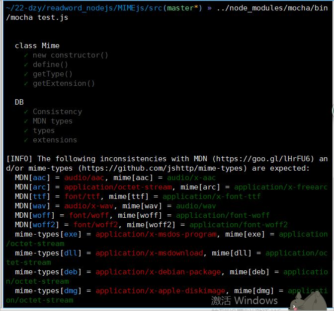
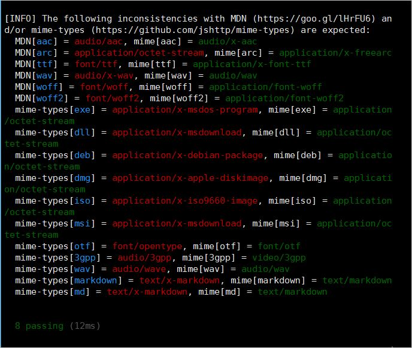

# readword_nodejs  
## MIME
源码：<https://github.com/wangzibingmy/nodeJS_readword/blob/master/src/test.js>    

源码注释解释：<https://github.com/wangzibingmy/readword_nodejs/blob/master/readword.js>  
- 该项目的功能是：自定义文件名类型和扩展名，对文件类型及扩展名进行测试  
- 项目类型：第三方库  
- 代码模块：测试用例,测试模块
- 单元测试(unit testing)，是指对软件中的最小可测试单元进行检查和验证。  
划分模块：  
>- 自定义文件及扩展名并对其进行测试  
>- 测试在区分大小写的情况下，类型或扩展名是否相等
>- 测试文件路径的类型（扩展名）和指定类型（扩展名）是否相等
>- 测试在https://goo.gl/lHrFU6 列出的MDN类型，如果有不同，执行after里面的内容  
>- getType():这个函数会根据传进来的URI，生成一个代表MimeType的字符串；而此字符串的生成也有规则：  如果是单条记录应该返回以vnd.android.cursor.item/ 为首的字符串;如果是多条记录，应该返回vnd.android.cursor.dir/ 为首的字符串
- 测试结果：  
  
   
- 经过这次研读代码的经历，学习到关于MIME的许多知识，锻炼了自身读代码的能力，扩展了视野。更懂得了只要认真对待就有成果的道理。
